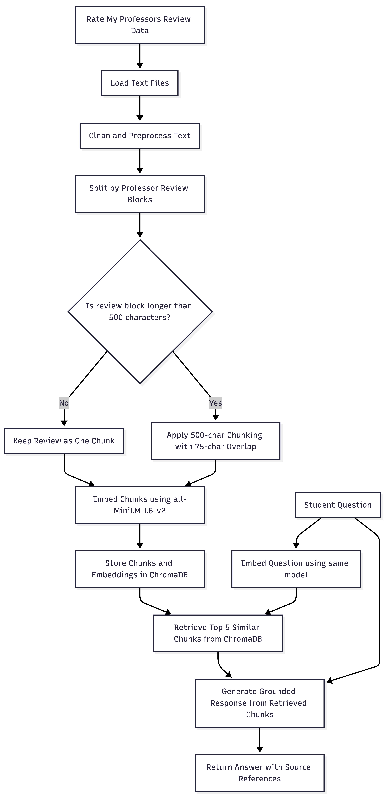

# Project 1 Planning: The Unofficial Guide

---

## Domain

My domain is UIUC CS professor reviews based on student feedback. The guide will help students search informal feedback about professors’ teaching style, clarity, difficulty, grading, workload, attendance expectations, and overall student experience.

This knowledge is hard to find because professor feedback is scattered across separate review pages and mixed with subjective comments. Students often need to manually compare many professors, courses, and review patterns, so a searchable guide can help surface useful themes faster.

---

## Documents

| # | Source | Description | URL or location |
|---|--------|-------------|-----------------|
| 1 | Rate My Professors - Tarek Abdelzaher | Student reviews for Tarek Abdelzaher, including feedback on CS423/CS424 teaching style, difficulty, grading, and course organization. | https://www.ratemyprofessors.com/professor/797719 |
| 2 | Rate My Professors - Sarita Adve | Student reviews for Sarita Adve, with comments on CS433 lectures, course difficulty, exams, support, and accessibility outside class. | https://www.ratemyprofessors.com/professor/119673 |
| 3 | Rate My Professors - Vikram Adve | Student reviews for Vikram Adve, including feedback on CS241/CS426/CS526 clarity, projects, grading, and overall teaching quality. | https://www.ratemyprofessors.com/professor/1654175 |
| 4 | Rate My Professors - Rishika Agarwal | Student reviews for Rishika Agarwal, mainly focused on TA support, explanation quality, and student experience in INFO102. | https://www.ratemyprofessors.com/professor/2640650 |
| 5 | Rate My Professors - Abdussalam Alawini | Student reviews for Abdussalam Alawini, including feedback on CS411 structure, SQL content, group project experience, exams, and lecture format. | https://www.ratemyprofessors.com/professor/2442487 |
| 6 | Rate My Professors - Roy Campbell | Student reviews for Roy Campbell, covering CS423/CS498/CS523 experiences, online course quality, lecture content, and student support. | https://www.ratemyprofessors.com/professor/180294 |
| 7 | Rate My Professors - Lawrence Angrave | Student reviews for Lawrence Angrave, especially CS241 feedback on lecture engagement, workload, office hours, textbook/resources, and course difficulty. | https://www.ratemyprofessors.com/professor/1117293 |
| 8 | Rate My Professors - Arindam Banerjee | Student reviews for Arindam Banerjee, including CS412/CS598 feedback on lecture clarity, math-heavy content, homework difficulty, and course usefulness. | https://www.ratemyprofessors.com/professor/2750212 |
| 9 | Rate My Professors - Matthew Caesar | Student reviews for Matthew Caesar, covering CS437 experiences, lab difficulty, organization, availability, and teaching support. | https://www.ratemyprofessors.com/professor/1233560 |
| 10 | Rate My Professors - Chandra Chekuri | Student reviews for Chandra Chekuri, especially CS374 feedback on lecture clarity, exam difficulty, grading/curve, and accessibility outside class. | https://www.ratemyprofessors.com/professor/1901793 |
| 11 | Rate My Professors - Charles Martin Jr. | Student review for Charles Martin Jr., focused on TA-style teaching support, workload, enthusiasm, and student understanding. | https://www.ratemyprofessors.com/professor/1698097 |

---

## Chunking Strategy

**Chunk size:** Structure-aware chunks, with a 500-character fallback limit for oversized records.

**Overlap:** 75 characters only for oversized records that need fallback sliding-window splitting.

**Reasoning:** 
I will use professor-review blocks as the primary chunking unit because my documents are structured around individual student reviews. Each review usually contains important context such as the professor name, course code, rating, difficulty, date, and student comment, so keeping these fields together should make retrieval more accurate. For records that are longer than the target chunk size, I will use a 500-character chunk size with a 75-character overlap. This fallback prevents long reviews from becoming too large while still preserving enough surrounding context between chunks.

---

## Retrieval Approach

**Embedding model:** all-MiniLM-L6-v2 via sentence-transformers

**Top-k:** 4 or 5

**Production tradeoff reflection:**
I would choose top-k = 5 for this domain because professor-related questions often need multiple review chunks to identify repeated patterns in student feedback, such as lecture clarity, workload, grading, difficulty, and accessibility.

Using too few chunks could miss important professor-review connections or rely too heavily on one student’s opinion. Using too many chunks could introduce noise from unrelated professors, courses, or one-off comments.

---

## Evaluation Plan

| # | Question | Expected answer | 
|---|----------|-----------------| 
| 1 | What do students say about Lawrence Angrave’s teaching style in CS241? | Students generally describe Lawrence Angrave as passionate, engaging, and helpful. Reviews mention that CS241 is difficult and workload-heavy, but his lectures, resources, and office hours make the course more manageable. | 
| 2 | Which professor reviews mention that the class is difficult but still worthwhile? | Reviews for Sarita Adve, Lawrence Angrave, Vikram Adve, and Chandra Chekuri mention challenging courses but also describe the professors as strong lecturers or supportive instructors. | 
| 3 | Are there any professors whose reviews mention unclear grading or poor course organization? | Yes. Reviews for Tarek Abdelzaher mention unclear grading and confusing course structure. Reviews for Abdussalam Alawini mention unclear instructions, disconnected group projects, and weak lecture structure. Some Matthew Caesar reviews also mention organization and availability issues. | 
| 4 | Which professors are described as accessible, helpful, or caring outside of class? | Sarita Adve, Lawrence Angrave, Chandra Chekuri, and Matthew Caesar have reviews that describe them as accessible, helpful, caring, or supportive outside of class. | 
| 5 | What are the common complaints about Abdussalam Alawini’s CS411 reviews? | Common complaints include surface-level teaching, mandatory attendance, unclear instructions, tricky exams, and a group project that students felt was disconnected from the class content. |

---

## Anticipated Challenges

1. **Reviews may be subjective or inconsistent:** Since the documents come from student reviews, some comments are very detailed while others are short or based on one person’s experience. This could make it hard for the system to give a balanced answer unless it retrieves multiple reviews for the same professor. 

2. **Chunks may lose important context:** Each review depends on nearby information like the professor name, course code, rating, difficulty, and date. If chunking separates the comment from this metadata, the system might retrieve a useful sentence but not know which professor or course it refers to.

---

## Architecture

The system loads professor review documents, splits them into review-based chunks, embeds them with `all-MiniLM-L6-v2`, and stores them in ChromaDB. For each question, it retrieves the top 5 relevant chunks and generates a grounded answer with source references.

---

## AI Tool Plan

**Milestone 3 — Ingestion and chunking:** I will give Claude my Documents and Chunking Strategy sections and ask it to implement loading the review text file and splitting it by professor-review blocks. I will verify that chunks keep the professor name, course code, rating, and review text together. 

**Milestone 4 — Embedding and retrieval:** I will give Claude my Retrieval Approach and ask it to create embeddings using `all-MiniLM-L6-v2`, store them in ChromaDB, and retrieve the top 5 chunks for a query. I will test it using my Evaluation Plan questions.

**Milestone 5 — Generation and interface:** I will use ChatGPT or Claude to help write the grounded response prompt and simple Gradio interface. I will verify that answers only use retrieved context and include source references.
